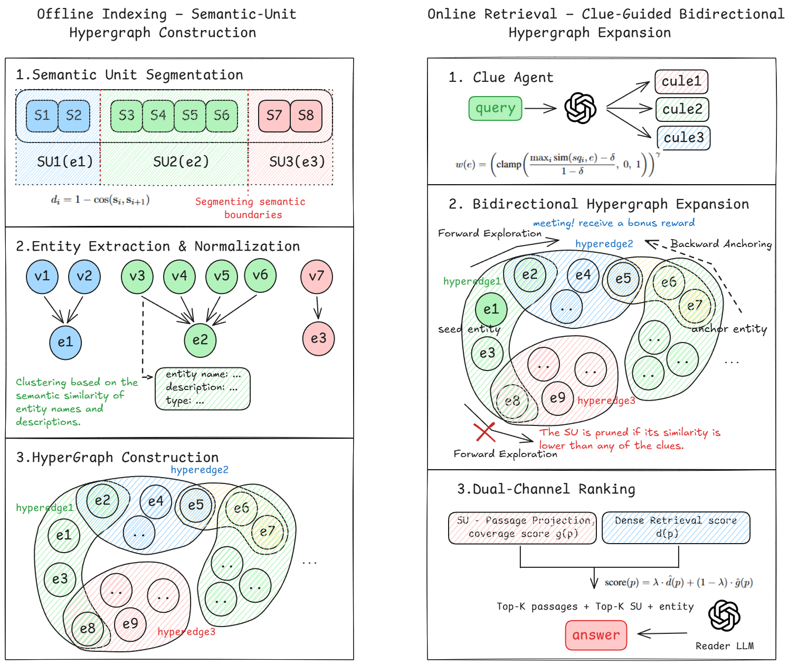

# HyperSU

A hypergraph-based retrieval framework for multi-hop question answering.

## What's different

Most graph-based RAG systems build pairwise entity-relation graphs via LLM extraction. HyperSU takes a different route:

**Semantic units as hyperedges.** HyperSU splits each passage into semantic units (coherent sentence groups) and treats each SU as a hyperedge connecting all co-occurring entities. Unlike pairwise knowledge graphs that flatten n-ary relations into triples, a single hyperedge keeps the joint context intact. Original text is preserved; no LLM rewriting is required.

**Planner-guided conductance gating.** When `use_planner=True`, a planner decomposes complex questions into focused sub-queries. These sub-query embeddings condition the hyperedge conductance gate, so an SU can be activated when it is relevant to any reasoning hop.

**Bidirectional frontier expansion.** HyperSU expands from query-linked seed entities and, unless disabled, also expands backward from dense-retrieval candidate passages. SUs reached by both directions receive a convergence bonus, helping recover evidence paths that one-way expansion can miss.

## Architecture



## How it works

### Indexing

1. Start from a list of passages
2. Split each passage into semantic units
3. Extract entity mentions from each SU with an OpenAI-compatible LLM
4. Merge mentions into canonical entity nodes
5. Build the hypergraph: entities are vertices, SUs are hyperedges
6. Cache passage, entity, SU embeddings, extraction results, and graph state under `save_dir`

### Retrieval

1. Embed the query and extract query seed entities
2. Optionally decompose the query into sub-queries (`use_planner=True`)
3. Run forward expansion from query entities through conductance-gated SUs
4. Run backward expansion from dense-retrieval top passages (`disable_backward=False`)
5. Score passages with dense similarity plus SU coverage
6. Optionally rerank candidates (`use_reranker=True`)

## Setup

```bash
pip install -r requirements.txt
python -m spacy download en_core_web_trf

export OPENAI_API_KEY="your-key"
export OPENAI_BASE_URL="your-base-url"
```

## Usage

```python
from hypersu import HyperSU
from hypersu.chunker import chunk_corpus_by_tokens

model = HyperSU(
    save_dir="./index_store/my_corpus",
    llm_model_name="gpt-4o-mini",
    ner_model_id="gpt-4o-mini",
    embedding_model_name="BAAI/bge-large-en-v1.5",
    use_planner=True,
)

# If your corpus is already split into passages, pass the list directly.
passages = [
    "0: Ada Lovelace wrote notes on the Analytical Engine.",
    "1: Charles Babbage designed the Analytical Engine.",
]

# For one long corpus string, split it into passages first.
# passages = chunk_corpus_by_tokens(
#     corpus_text,
#     chunk_size=1200,
#     overlap=100,
#     nlp_model=model.spacy_model,
#     embedding_model=model.embedding_model,
# )

model.index(passages)

results = model.retrieve(
    ["Who designed the machine that Ada Lovelace wrote notes about?"],
    num_to_retrieve=5,
)

for passage, score in zip(results[0]["passages"], results[0]["scores"]):
    print(f"{score:.3f}\t{passage}")
```

`index()` is incremental: embeddings and extraction results are reused from `save_dir` when the corpus and relevant config are unchanged. `retrieve()` returns a list of dictionaries with `query`, `passages`, and `scores`; when planner decomposition is used, results may also include `sub_queries`.

## Key parameters

| Parameter | What it controls |
|---|---|
| `save_dir` | Where index artifacts and caches are stored |
| `retrieval_top_k` | Default number of passages returned by `retrieve()` |
| `num_to_retrieve` | Per-call override passed to `retrieve()` |
| `use_planner` | Enables LLM sub-query decomposition |
| `expansion_max_hops` | Max hops in forward hypergraph expansion |
| `expansion_top_k` | Vertices kept per expansion hop |
| `conductance_floor` | Gate threshold for hyperedge activation |
| `conductance_gamma` | Sharpening exponent for gate scores |
| `scoring_lambda` | Fusion weight: dense similarity vs. hypergraph coverage |
| `backward_seed_top_k` | Dense top passages used to seed backward expansion |
| `backward_max_hops` | Max hops for backward expansion |
| `disable_backward` | Disables backward expansion for ablation |
| `use_reranker` | Enables Qwen reranking over candidate passages |

## Project structure

```text
hypersu/
  engine.py          # main pipeline: indexing, retrieval, QA
  frontier.py        # hypergraph frontier expansion
  knowledge_graph.py # entity-passage edges and entity-SU hyperedges
  chunker.py         # passage chunking and SU splitting
  extractor.py       # LLM-backed entity extraction
  entity_merge.py    # canonical entity merging
  clue_agent.py      # optional sub-query planner
  embedding_store.py # parquet-backed embedding cache
  reranker.py        # optional Qwen reranker
  config.py          # configuration dataclass
```
