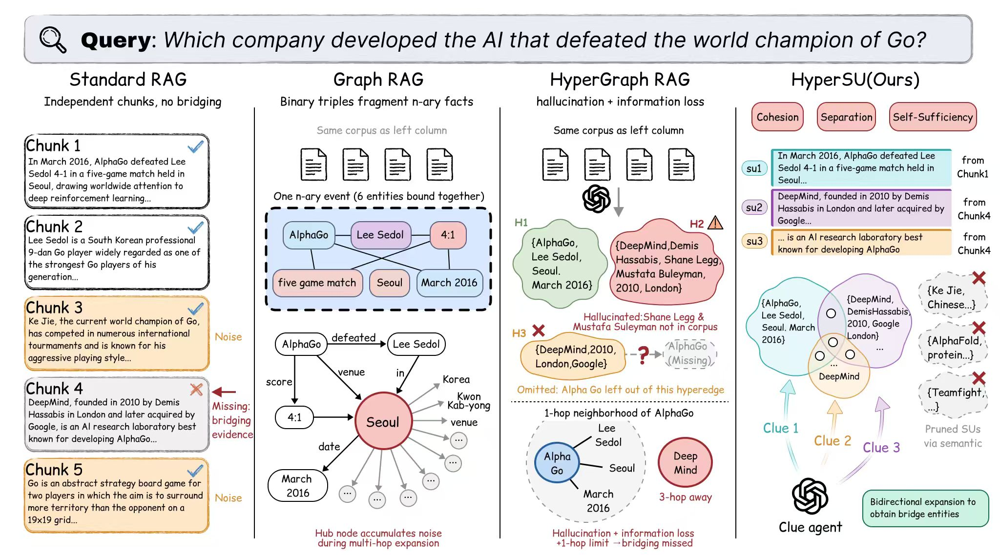
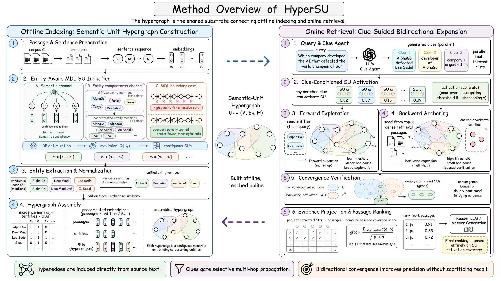

# HyperSU

**HyperSU: Corpus-Driven Semantic-Unit Hypergraph for Retrieval-Augmented Generation**

HyperSU is a hypergraph-based RAG framework that constructs source-grounded semantic-unit hyperedges directly from corpus text and performs clue-guided bidirectional retrieval for multi-hop reasoning.

## Motivation



Existing RAG paradigms face different limitations: standard RAG retrieves isolated chunks, graph-based RAG decomposes n-ary evidence into fragmented binary edges, and prior hypergraph-based RAG often relies on LLM-generated hyperedges that may introduce unsupported relations or omit bridge entities.

HyperSU addresses these issues by treating compact semantic units from the source corpus as hyperedges over co-mentioned entities, preserving provenance while avoiding offline LLM-generated relational summaries.

## Method



HyperSU consists of two stages:

1. **Semantic-Unit Hypergraph Construction**  
   HyperSU extracts sentence-level entity mentions, induces contiguous semantic units with an entity-aware MDL objective, and builds a hypergraph where each semantic unit is a source-grounded hyperedge.

2. **Clue-Guided Bidirectional Retrieval**  
   At query time, a clue agent decomposes the question into retrieval clues. HyperSU expands forward from query-linked entities and anchors backward from dense-retrieved answer-side evidence, using convergence to identify reliable multi-hop reasoning chains.

## Environment Setup

### Python Requirements

Python 3.10+ is recommended. The local development environment uses Python 3.10.12.

### Create and Activate a Virtual Environment

```bash
python3.10 -m venv .venv
source .venv/bin/activate
python -m pip install --upgrade pip
```

### Install Dependencies

```bash
pip install -r requirements.txt
```

If you plan to run HyperSU with GPU/CUDA, install the PyTorch build that matches your CUDA version.

### Configure `.env`

Create a `.env` file in the project root:

```env
OPENAI_API_KEY=your_api_key_here
OPENAI_BASE_URL=https://api.openai.com/v1
LLM_MODEL_NAME=gpt-4o-mini
MAX_WORKERS=16
HF_HUB_OFFLINE=0
```

## Usage

The main interface is `HyperSU`. A typical workflow is:

1. Prepare a corpus as passages.
2. Build the HyperSU index with `index()`.
3. Retrieve evidence with `retrieve()`.
4. Optionally generate answers with `rag_qa()`.

### Index Corpus

```python
from hypersu import HyperSU

model = HyperSU(
    save_dir="./index_store/my_corpus",
    use_planner=True,
)

passages = [
    "AlphaGo defeated Lee Sedol in a five-game match in Seoul in March 2016.",
    "DeepMind is an AI research laboratory known for developing AlphaGo.",
]

model.index(passages)
```

If the corpus is a single long document, split it into passages before indexing:

```python
from hypersu.chunker import chunk_corpus_by_tokens

passages = chunk_corpus_by_tokens(
    corpus_text,
    chunk_size=1200,
    overlap=100,
    sentence_splitter=model.sentence_splitter,
    embedding_model=model.embedding_model,
)

model.index(passages)
```

Index artifacts are saved under `save_dir` and reused automatically when the same corpus and index configuration are loaded again.

### Retrieve Evidence

```python
results = model.retrieve(
    ["Which company developed the AI that defeated the world champion of Go?"],
    num_to_retrieve=5,
)

for passage, score in zip(results[0]["passages"], results[0]["scores"]):
    print(f"{score:.3f}\t{passage}")
```

Each retrieval result contains the query, ranked passages, and scores:

```python
{
    "query": "...",
    "passages": [...],
    "scores": [...],
}
```

When `use_planner=True`, results may also include `sub_queries`, the clue-style decompositions used during retrieval.

### Retrieve and Generate Answers

```python
answers = model.rag_qa(
    ["Which company developed the AI that defeated the world champion of Go?"]
)

print(answers[0]["answer"])
print(answers[0]["passages"])
```

`rag_qa()` first retrieves passages with HyperSU, then sends the retrieved context to the reader LLM for answer generation.
